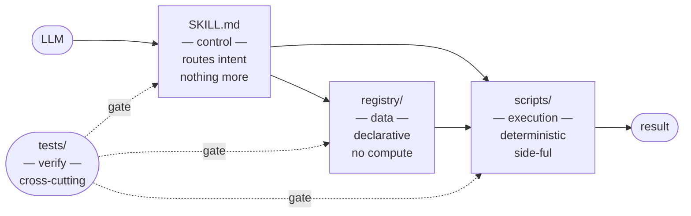

<h1 align="center">skills</h1>

<i><b>My agent skills, using my "3-plane" architecture. Scripts > prose</b></i>

[![Github][github]][github-url]

 

## The three-plane split

Every entity in this repo lives on exactly one of three planes. Cross-plane calls flow downward only.

**Why the split matters:**

- **Control plane** is the only part the LLM touches. It routes intent, nothing more. No business logic. No parameter guessing.
- **Data plane** is JSON. JSON cannot execute code. That boundary is mechanical, not convention. This is the only place an LLM cannot smuggle logic through prose.
- **Execution plane** is deterministic. Same input, same output. The LLM reads results, never writes them.
- **Verify** is cross-cutting. Tests, schema checks, gates. Spans all three planes, belongs to none.

Flow is strict: `LLM → SKILL.md → script → registry`. Backward flow is a bug.

The entire thing fits one invariant: **same separation of concerns, different packaging.**

---

The reason this matters is not aesthetic. It is about which failure modes you are exposed to.

Give an agent prose and it does not read it fresh. It pattern-matches against its training distribution. Instruction that looks like documentation gets treated like documentation- descriptive, not prescriptive. It sees familiar language shapes and follows their gravity instead of yours. The more room the prose gives it to deliberate, the more confident it becomes that deliberating is the correct response. You asked it to do something. It decided to think about whether to do it.

Three specific failure modes that prose enables, in order of how often they bite:

- **Momentum**: the agent continues the pattern it recognizes rather than executing the instruction you gave. Familiar structure → familiar behavior. Yours was different. Doesn't matter.
- **Deferral**: prose that sounds like a recommendation is treated as one. "You should probably do X" becomes an invitation to weigh X against context. Scripts don't have this surface. `bash x.sh` does not ask itself whether X is appropriate.
- **Scope bleed**: more content in a `SKILL.md` means more concepts to balance. The agent's job shifts from routing to interpretation. Interpretation compounds across sessions, models, and temperatures. Same skill, different output.

The three-plane split does not ask the agent to stay in its lane. It makes other lanes structurally inaccessible. JSON has no runtime- the agent cannot introduce logic there. The execution plane does not involve the agent- it cannot introduce non-determinism there. Decision authority is not "discouraged" in those planes. It is mechanically absent.

The control plane is the only surface the agent touches. Everywhere else, the architecture makes the decision for it.

## Catalog

| | skill | brief | when | why |
|---|---|---|---|---|
|  | [amazon](deep-research/amazon/) | Amazon product search + ASIN lookup | Price comps, review scraping, deal hunts | PA-API requires $4k+/mo throughput + approval. Public search endpoints work for 95% of use cases. |
|  | [hackernews](deep-research/hackernews/) | HN Firebase API scraper - stories, users, exhaust | Technical trend hunting, user vetting | HN Algolia search is rate-limited and lossy; direct Firebase is uncapped. |
|  | [npmjs](deep-research/npmjs/) | Package lookup, downloads, dependents | Dep review, supply chain audit | npm registry API returns inconsistent shapes per endpoint. One wrapper beats three. |
|  | [redfin](deep-research/redfin/) | Listings by market via Stingray API | Real estate research, market comps | No public MLS feed; Stingray is undocumented but public. Zillow API is paywalled. |
|  | [twitter](deep-research/twitter/) | User activity, syndication endpoint | Social intel, timeline scraping | Official X API is $5k+/mo for anything useful. Syndication endpoints are free. |
|  | [arxiv](deep-research/arxiv/) | arXiv search, paper fetch, category browse | Research discovery, literature review | arXiv API is public and uncapped. Semantic Scholar and Elsevier are paywalled or rate-hostile. |
|  | [github](deep-research/github/) | Repo metadata, user profiles, search, releases, issues | Repo vetting, maintainer research, release tracking | GitHub API v3 is public (60 req/hr unauthed, 5000 with token). No scraping needed. |
|  | [mirror](thinking/mirror/) | N-round PRIME/MIRROR adversarial self-dialogue | Hard decisions, missed-angle hunts | LLMs converge on the first plausible answer. Forced adversarial rounds surface counter-examples. Multi-agent debate improves reasoning across benchmarks (Du et al, 2023). |
|  | [matryoshka](thinking/matryoshka/) | Nested trust-layer peeling - finds where enforcement ends and behavioral trust begins | System auditing, finding soft spots | Complex systems have load-bearing layers and dressing. The transition layer (mechanical → behavioral) is always weakest. |
|  | [centipede](thinking/centipede/) | Sequential cross-domain digestion - each link absorbs what the prior cannot | When single-domain depth plateaus | Analogical transfer across domains produces qualitative phase transitions in understanding (Gentner, 1983). |
|  | [ouroboros](thinking/ouroboros/) | Strange-loop audit - the instance writes rules, fails against them, dies; the rules survive to trap the next instance | When adding a rule to fix a rule keeps failing across sessions | The recursion IS the finding. Enforcement accumulates; compliance doesn't. Naming the loop is the only way to step outside it. |
|  | [premortem](thinking/premortem/) | Klein-method prospective hindsight - assume the failure already happened, reconstruct why | Before launching, hiring, signing | Assuming failure in advance surfaces 30%+ more failure modes than forward planning (Mitchell et al, 1989). |
|  | [potemkin](thinking/potemkin/) | Constraint extraction + reparameterization - names the actual blocking constraint, tests if it's hard or soft | When stuck on the same wall repeatedly | Systems don't say why they're stuck. Naming the actual blocking constraint exposes whether it's immovable or a framing artifact. |
|  | [machreadify](tools/machreadify/) | Prose to structured JSON/YAML | Before passing data to another LLM | Structured input beats prose for downstream reliability and cuts tokens 40-60%. |
|  | [yaml-workflow](tools/yaml-workflow/) | Prose plans to terse YAML workflows | Multi-step plans with phases | A plan in prose dies on contact. A plan with required fields survives. |
|  | [extract](tools/extract/) | Deep entity + command extractor - rabid-raccoon mode | When summaries miss things | Models skim politely by default. Rabid-raccoon mode catches what polite reading misses. |
|  | [loop](tools/loop/) | Iterative test-fix loop | Red-green dev work | Replaces 30-line retry/backoff boilerplate every time you need it. |
|  | [thread-needle](tools/thread-needle/) | Single-command-chain shell execution | No-artifact pipelines, one-shot transforms | Temp files are a debugging surface. Inline pipelines are not. The discipline forces tighter thinking. |
|  | [spoonfeed](tools/spoonfeed/) | Step-by-step ping-pong guided mode - one step, validate, next | Walking someone through a flow | Autonomy theater loses the human. One step + validate = real transfer. AI prescribes; human executes. |
|  | [devspeak](voice/devspeak/) | Developer voice compression | Writing for engineers | Code reviewers hate corporate prose. Terse bullets, no qualifiers, 90% adjective cut. |
|  | [subspace](voice/subspace/) | Liminal observational state - drop structure, observe without performing | When the model is in presentation mode | Dropping structure produces sharper output when the model stops trying to impress. |
|  | [humanize](voice/humanize/) | Anti-AI-tell output pass -- 28 laws, pre-delivery mandatory | Before any human sees generated text | LLMs leak signatures (em-dashes, "furthermore", "leverage", "delve"). One pre-ship pass strips them. |

Folder grouping (same 22 skills, physically organized):

- `deep-research/` - sources (7)
- `thinking/` - cognitive patterns (6)
- `tools/` - utilities (6)
- `voice/` - output discipline + state (3)

<!-- BADGES -->
[github]: https://img.shields.io/badge/skills-000000?style=for-the-badge&logo=github&logoColor=white
[github-url]: https://github.com/vdutts7/skills
